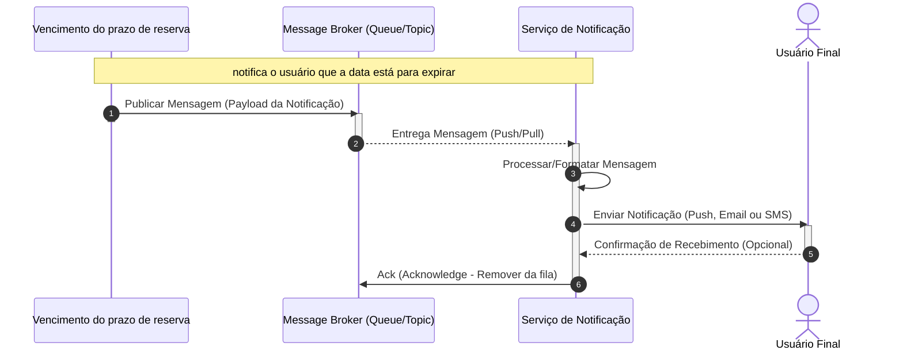

```mermaid
sequenceDiagram
    autonumber
    participant S as Vencimento do prazo de reserva
    participant MB as Message Broker (Queue/Topic)
    participant SN as Serviço de Notificação
    actor U as Usuário Final

    Note over S, SN: notifica o usuário que a data está para expirar
    S->>MB: Publicar Mensagem (Payload da Notificação)
    activate S
    deactivate S

    activate MB
    MB-->>SN: Entrega Mensagem (Push/Pull)
    deactivate MB

    activate SN
    SN->>SN: Processar/Formatar Mensagem
    SN->>U: Enviar Notificação (Push, Email ou SMS)
    activate U
    U-->>SN: Confirmação de Recebimento (Opcional)
    deactivate U
    
    SN->>MB: Ack (Acknowledge - Remover da fila)
    deactivate SN

```
