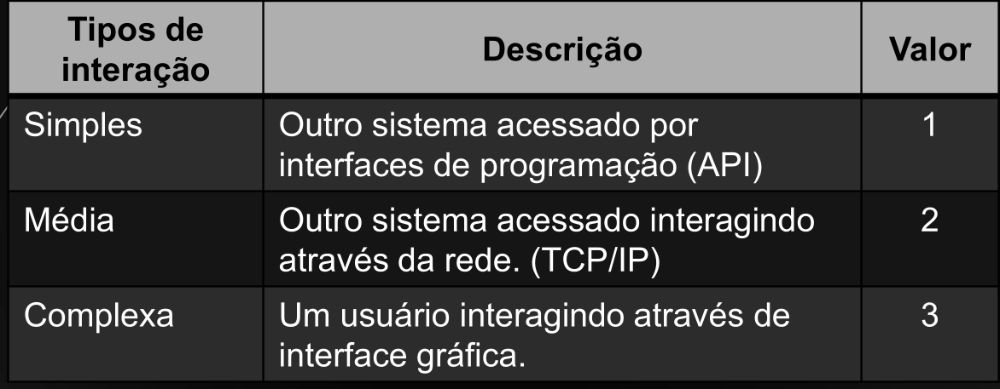
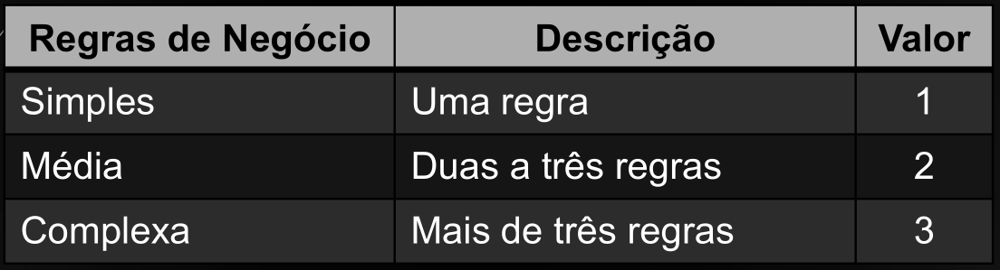
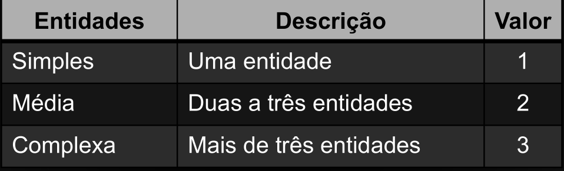
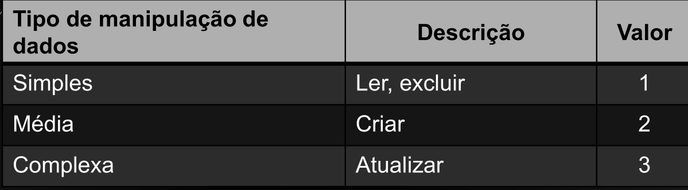
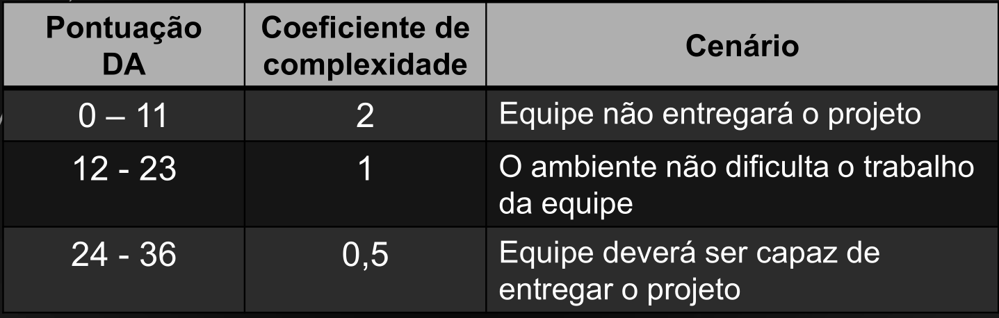

## Definição da complexidade do projeto:

## Complexidade com base na regra de negócio:

## Número de entidades:

## Fator de manipulação de dados:

## Definição do coeficiente de complexidade (C):

## Equação de pontos ajustados (PA):

$$
PA = {PNA} \cdot {DA}
$$

## Equação de pontos por caso de uso (PUC):

$$
PUC = \dfrac{PA \cdot DA}{36}
$$

Dimesões do ambiente (DA)

