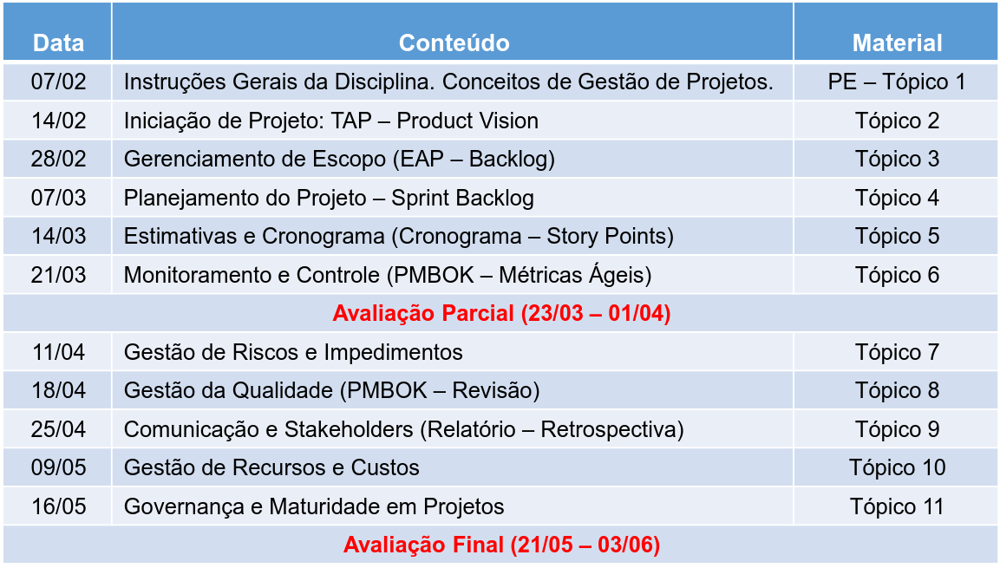
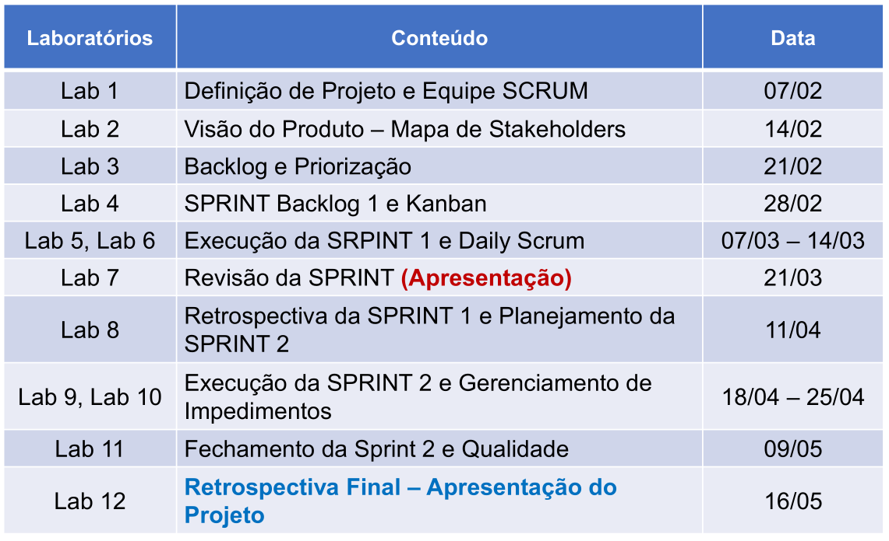

voltar para [Índice Main](file:///workspace/637f30eb-b9d0-4f04-8d4e-54781b057ad2/M-kfwhrRG77qihIH3jlIX)

# Relação da pasta de Gestão de projetos

Documentos relacionados as aulas estão na pasta `Aulas`

Repositório desta matéria localizado em:

[Adelgrin/Gestao\_projetos](https://github.com/Adelgrin/Gestao_projetos)

$$
NF = (AP \cdot 0.3) + (AF \cdot 0.3) + (LAB \cdot 0.4)
$$

# Cronograma:

# Cronograma Laboratório:

