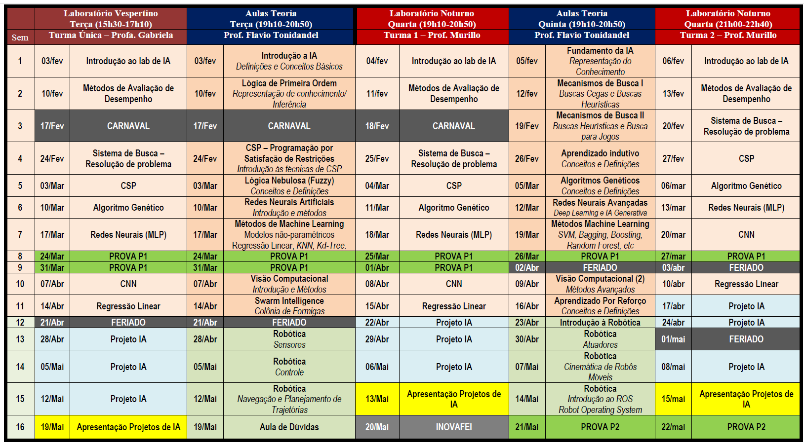

# Índice inteligência artifical

voltar para [Índice Main](file:///workspace/637f30eb-b9d0-4f04-8d4e-54781b057ad2/M-kfwhrRG77qihIH3jlIX)

# Relação da pasta de Inteligência artificial

Documentos relacionados as aulas estão na pasta `Aulas`

Documentos relacionados as aulas de laboratório estão na pasta `LABS`

Repositório da matéria localizado em: 

[Adelgrin/inteligencia\_artificial](https://github.com/Adelgrin/inteligencia_artificial)

$$
Média = \dfrac{P1 + P2 + Lab + Proj}{4}
$$

# Cronograma: 

