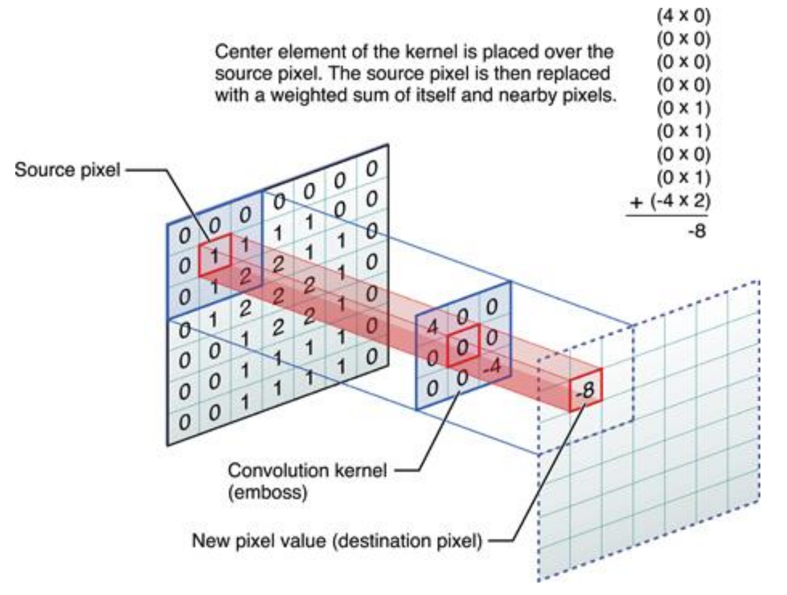
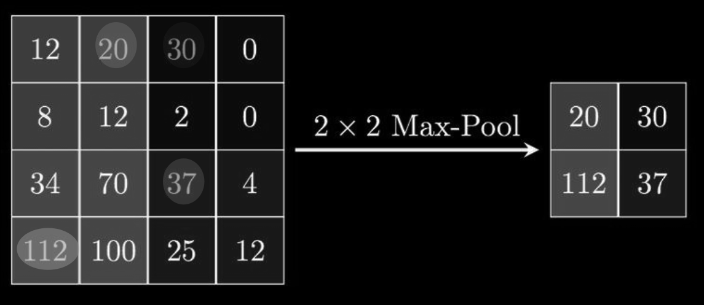

## Treinamento de redes neurais para ../imagens:

consiste no processo de simplificar a imagem ultilizando convolução, onde é calculado um kernel e deste kernel calculado um valor para a imagem:

### Aplicação ReLU

após a convolução é aplicado o `ReLU` que considera todos os valores menores que 0 como 0

### Aplicação Maxpooling

dada uma matrix podemos fazer o maxpooling para de um valor menor que a matrix dada,  onde se extrai os maiores valores da matrix para o tamanho desejado

## Saída softmax:

Tem uma saída de valor 1 para definir a probabilidade

$$
f^{n}_{i}(NET^{n}_{i}) = \dfrac{e^{NET^{V}_{i}}}{\sum^{k}_{j} e^{NET^{V}_{j}}}
$$

