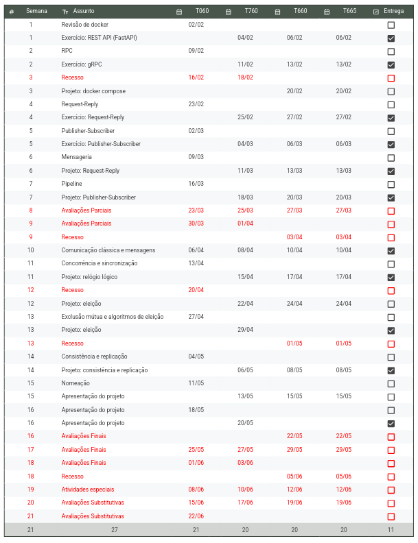

# Índice Sistemas distribuídos

---

# Relação da pasta de Sistemas distribuídos

Documentos relacionados a projeto estão na pasta `Projeto`

Documentos relacionados as aulas estão na pasta `Aulas`

Documentos relacionados as aulas de laboratório estão na pasta `LABS`

esta aula conta com um repositório em:

[GitHub - Adelgrin/Sistemas\_distribuidos](https://github.com/Adelgrin/Sistemas_distribuidos)
$$
MF = (0.5 \cdot P1 + 0.5 \cdot P2) \cdot f \\

    f = \dfrac{\textrm{quantidade de atividades entregue}}{\textrm{quantidade de atividades no semestre - 1}} 
$$

# Cronograma:

