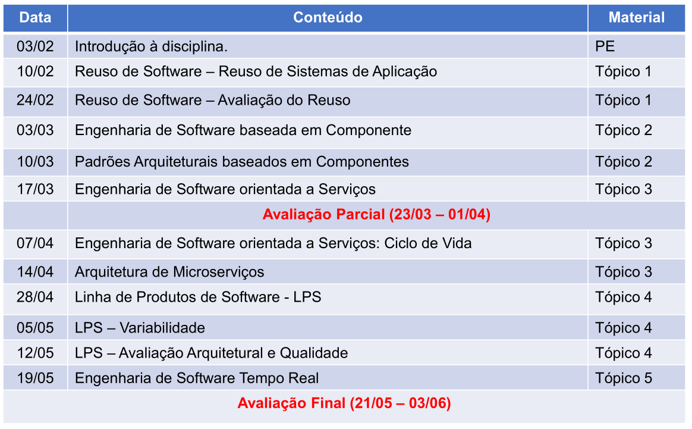
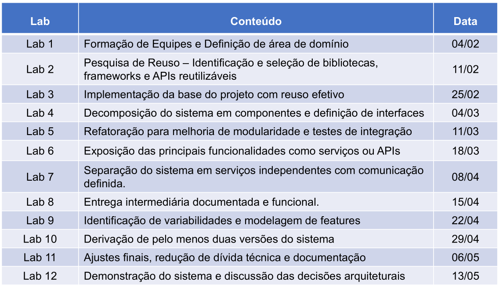

# Índice Tópicos avaçados de engenharia de software

---
# Relação da pasta de Tópicos avançados de engenharia de software

Documentos relacionados as aulas estão na pasta `aulas` 

Documentos relacionados as aulas de laboratório estão na pasta `labs`

Repositório desta matéria localizado em:

[Adelgrin/eng\_software\_avc](https://github.com/Adelgrin/eng_software_avc)
$$
NF = (AP \cdot 0.3) + (AF \cdot 0.3) + (LAB \cdot 0.4) 
$$

# Cronograma geral:

# Cronogramas de laboratório:

