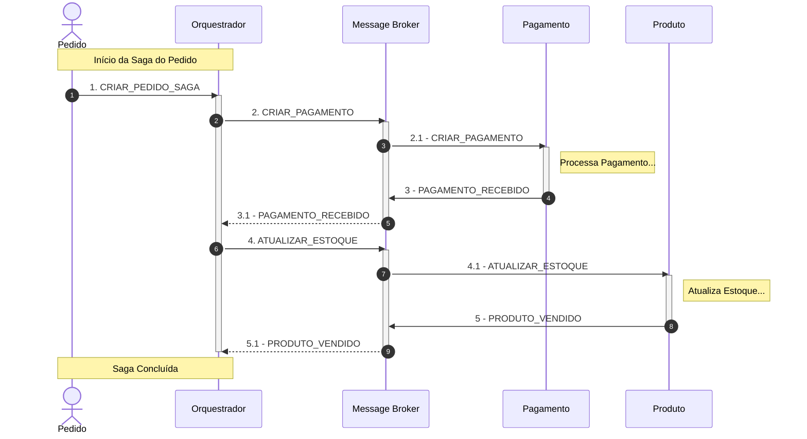
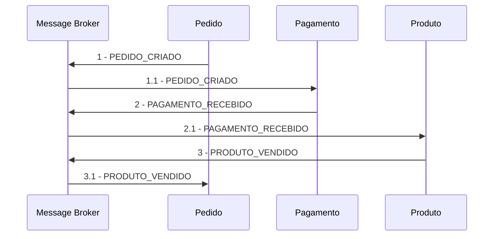

## Componentes vs Serviços

| Aspecto     | Componentes                       | Serviços                         |
| ----------- | --------------------------------- | -------------------------------- |
| Escopo      | Interno ao sistema                | (Externo entre sistemas)         |
| Comunicação | Chamada de metodo                 | HTTP, REST, mensagens            |
| Acoplamento | Médio (Dependencia direta)        | Baixo (contratos bem definidos)  |
| Interface   | Interfaces fornecidas/requeridas  | Contratos de serviço (API, JSON) |
| Exemplo     | ClienteComponente.buscarCliente() | GET /clientes{id}                |

## Orquestração

## Coreografia

## Testing
